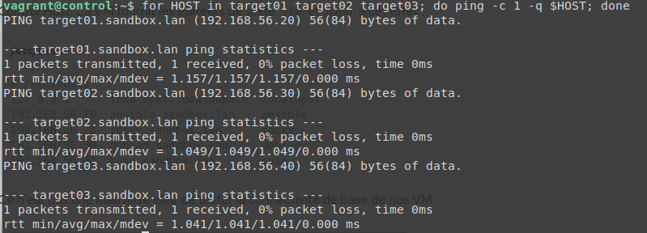
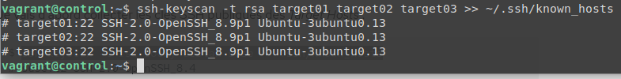
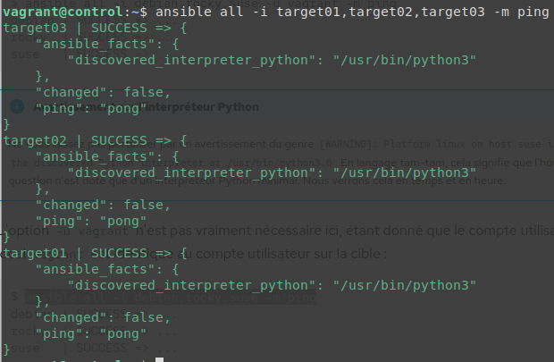

# Atelier 03 - Authentification

On se place dans le bon dossier : 
```
$ cd ~/formation-ansible/atelier-03
```

Puis on lance les VM avec :
```
$ vagrant up
```

On se connecte a la vm control :
```
$ vagrant ssh control
```

**Pour réussir un ping Ansible, il faut faire quelques étapes au préalable :**


On modifie notre fichier /etc/hosts de cette façon :
```
# /etc/hosts
127.0.0.1      localhost.localdomain  localhost
192.168.56.10  control.sandbox.lan    control
192.168.56.20  target01.sandbox.lan   target01
192.168.56.30  target02.sandbox.lan   target02
192.168.56.40  target03.sandbox.lan   target03
```

On peut vérifier avec un ping si la résolution DNS fonctionne :
```
$ for HOST in target01 target02 target03; do ping -c 1 -q $HOST; done
```


On récupère la clé publique de nos différentes VMs :
```
$ ssh-keyscan -t rsa target01 target02 target03 >> ~/.ssh/known_hosts
```


On génère ensuite une paire de clé sur notre VM control :
```
$ ssh-keygen
```

On envoie notre clé publique sur les différentes VMs targets :
```
$ ssh-copy-id vagrant@target01
$ ssh-copy-id vagrant@target02
$ ssh-copy-id vagrant@target03
```

On vérifie que nous pouvons faire un ping ansible :
```
$ ansible all -i target01,target02,target03 -m ping
```


Tout fonctionne !

