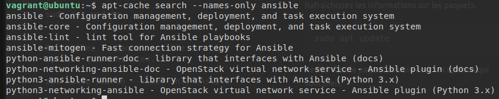
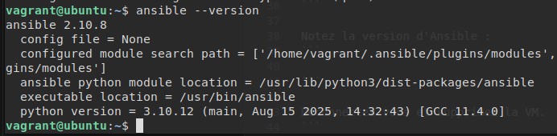
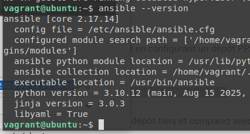

# Atelier 01 - Installation d'Ansible

### Challenge n°1 - Installation sur Ubuntu
Ubuntu étant basé sur debian, nous pouvons lancer les mêmes commandes que pour debian.

Démarrez la VM ubuntu depuis le répertoire atelier-01 : 
```
$ vagrant up ubuntu
```

Connectez-vous à cette VM :
```
$ vagrant ssh ubuntu
```

Rafraîchissez les informations sur les paquets :
```
$ sudo apt update
```

Recherchez le paquet ansible avec les options qui vont bien :
```
$ apt-cache search --names-only ansible
```


Installez le paquet officiel fourni par la distribution :
```
$ sudo apt install -y ansible
```

Vérifiez si l'installation s'est bien déroulée :
```
$ ansible --version
```

Notez la version d'Ansible :

Notre ansible est en version `2.10.8`

Déconnectez-vous et supprimez la VM :
```
$ exit
$ vagrant destroy -f ubuntu
```

### Challenge n°2 - Installation sur Ubuntu avec repo PPA
Préparation de la VM :
```
$ vagrant up ubuntu
$ vagrant ssh ubuntu
```

On ajoute ensuite le dépôt PPA pour ansible :
```
$ sudo apt-add-repository ppa:ansible/ansible
```

Puis on installe ansible :
```
$ sudo apt update
$ sudo apt install -y ansible
```

On vérifie notre version :
```
$ ansible --version
```


Notre ansible est en version `2.17.14`, donc une version bien plus récente que celle proposé par les dépots ubuntu/debian  

### Challenge n°3 - Installation sur Rocky avec pip
Lancement de la VM Rocky :
```
$ vagrant up rocky
$ vagrant ssh rocky
```

Installation de PIP :
```
$ sudo dnf install -y python3-pip
```

Création du venv :
```
$ python3 -m venv ~/.venv/ansible
```

```
$ source ~/.venv/ansible/bin/activate
(ansible) $
```

Mise à jour de pip :
```
(ansible) $ pip install --upgrade pip
```

Installation d'ansible :
```
(ansible) $ pip install ansible
```

Vérification de la version d'ansible
```
(ansible) $ ansible --version
```


On a donc un ansible en version `2.15.13`

Pour terminer, on fait du ménage : 
```
(ansible) $ deactivate
$ exit
$ vagrant destroy -f rocky
```