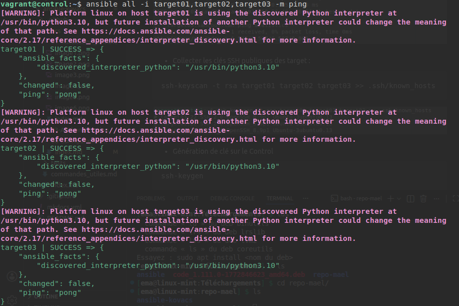
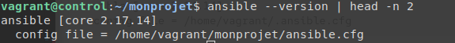
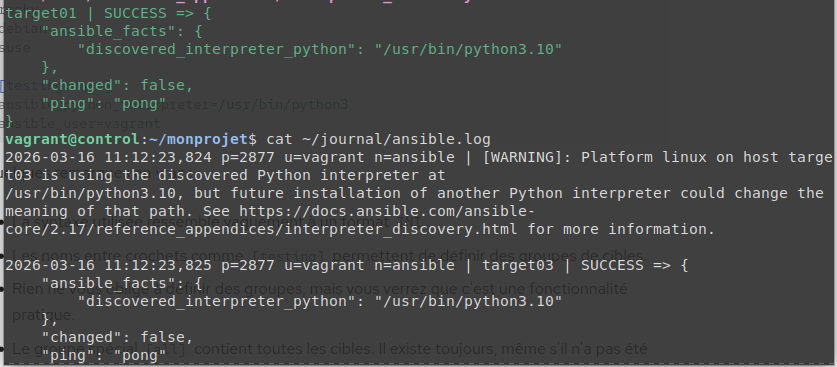
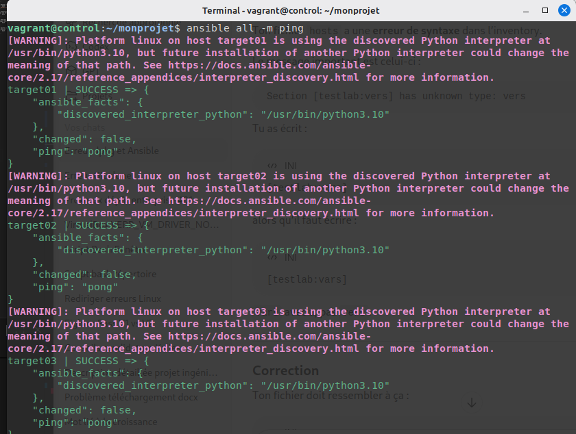
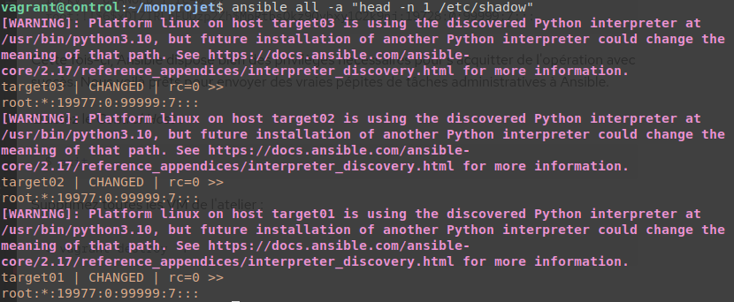
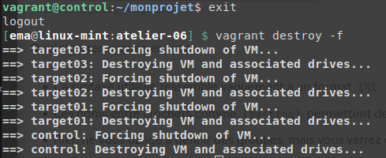
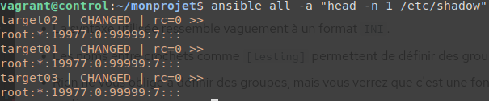

# Atelier 06 - Organiser un projet Ansible

### A vous de jouer : 


* Éditez /etc/hosts de manière à ce que les Target Hosts soient joignables par leur nom d'hôte simple.
```
192.168.56.10 control.sandbox.lan control
192.168.56.20 target01.sandbox.lan target01
192.168.56.30 target02.sandbox.lan target02
192.168.56.40 target03.sandbox.lan target03
```


* Configurez l'authentification par clé SSH avec les trois Target Hosts.
``` bash
$ ssh-keyscan -t rsa target01 target02 target03 >> .ssh/known_hosts

#Générer la clé sur "Control" 
$ ssh-keygen

#Distribution de la clé publique sur les targets : (vagrant)
$ ssh-copy-id vagrant@target01
$ ssh-copy-id vagrant@target02
$ ssh-copy-id vagrant@target03
```

* Installez Ansible.
``` bash
$ sudo apt update
$ sudo apt-add-repository ppa:ansible/ansible
$ apt-cache search --names-only ansible
$ sudo apt install -y ansible
$ ansible --version
```


* Envoyez un premier ping Ansible sans configuration.
``` bash
$ ansible all -i target01,target02,target03 -m ping
```


* Créez un répertoire de projet ~/monprojet.
``` bash
$ mkdir ~/monprojet
```

* Créez un fichier vide ansible.cfg dans ce répertoire.
``` bash
$ cd ~/monprojet
$ touch ansible.cfg
$ ls
```

* Vérifiez si ce fichier est bien pris en compte par Ansible.
``` bash
$ ansible --version | head -n 2
```
 

* Spécifiez un inventaire nommé hosts.
``` bash
$ vi ansible.cfg
    [defaults]
    inventory = ./hosts
```

* Activez la journalisation dans ~/journal/ansible.log.
``` bash
$ mkdir -v ~/journal/

#Modifier le fichier ansible.cfg

[defaults]
inventory = ./hosts
log_path = ~/journal/ansible.log

```

* Testez la journalisation.
``` bash
$ ansible all -i target01,target02,target03 -m ping
$ cat ~/journal/ansible.log
```



* Créez un groupe [testlab] avec vos trois Target Hosts.
``` bash
#Dans ~/monprojet
$ vi hosts
    [testlab]
    target01
    target02
    target03
```

* Définissez explicitement l'utilisateur vagrant pour la connexion à vos cibles.
``` bash
$ vi hosts
[testlab:vars]
ansible_user=vagrant

```

* Envoyez un ping Ansible vers le groupe de machines [all].
``` bash
$ ansible all -m ping
```



* Définissez l'élévation des droits pour l'utilisateur vagrant sur les Target Hosts.
``` bash
$ vi hosts
#dans [testlab:vars]
ansible_become=yes
```

* Affichez la première ligne du fichier /etc/shadow sur tous les Target Hosts.
``` bash
$ ansible all -a "head -n 1 /etc/shadow"
```


* Quittez le Control Host et supprimez toutes les VM de l'atelier.
``` bash
$ exit
$ vagrant destroy -f
```


* Supplémentaire : Préciser l'interpréteur python
### Pour éviter d'avoir les warnings Python
