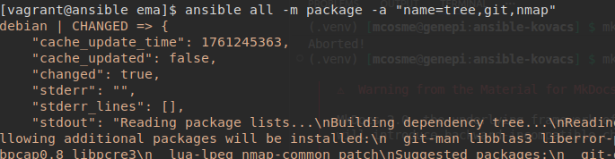
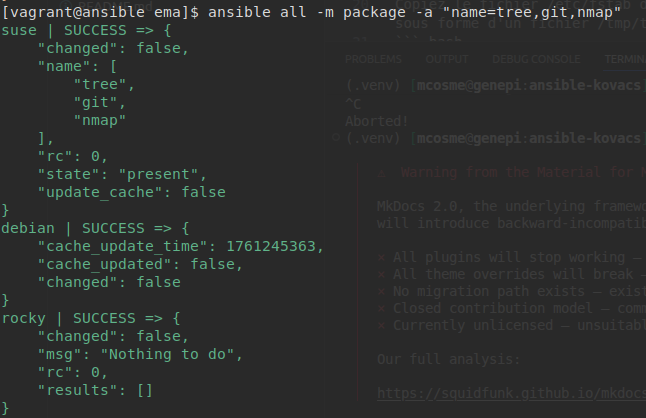
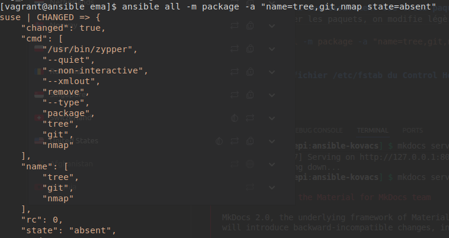
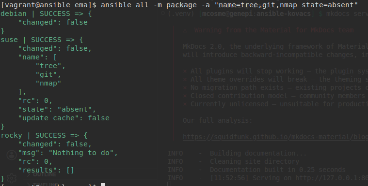
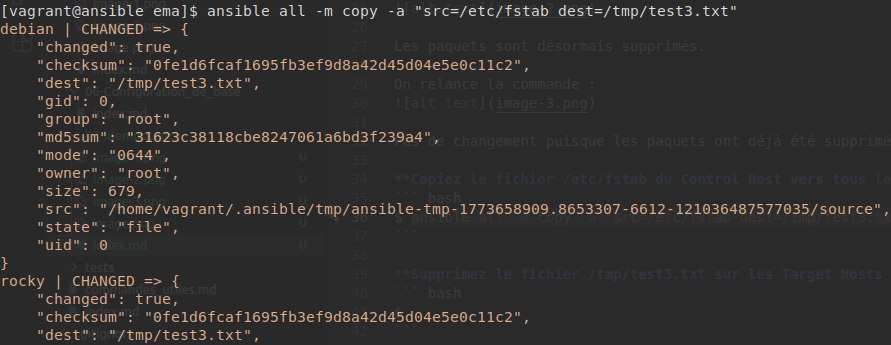
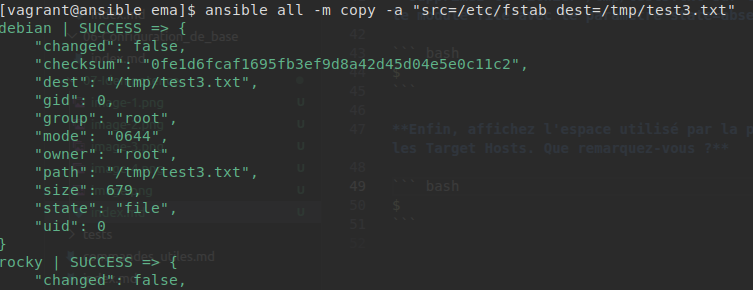
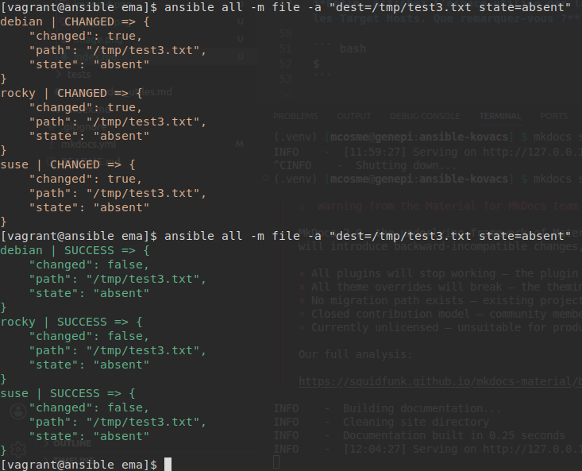
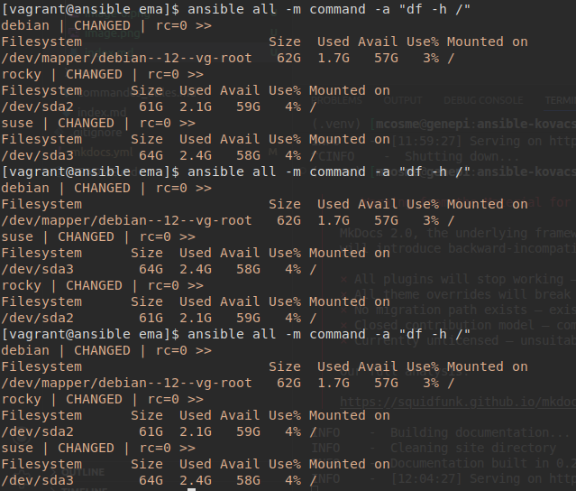

# Atelier 07 - Idempotence


**Installez successivement les paquets tree, git et nmap sur toutes les cibles.**

On lance l'installation des paquets une première fois :
``` bash
$ ansible all -m package -a "name=tree,git,nmap"
```


Nous pouvons constater que les paquets n'étaient pas encore installé sur nos VMs puisque le statut est dans l'état "CHANGED", les paquets ont donc été installés.

On relance cette même commande :

Cette fois ci rien n'a changé (ligne `"changed": false`) puisque les paquets ont déjà été installés.

**Désinstallez successivement ces trois paquets en utilisant le paramètre supplémentaire state=absent.**

Pour supprimer les paquets, on modifie légèrement la commande précdente :
``` bash
$ ansible all -m package -a "name=tree,git,nmap state=absent"
```


Les paquets sont désormais supprimés.

On relance la commande :


Pas de changement puisque les paquets ont déjà été supprimés.

**Copiez le fichier /etc/fstab du Control Host vers tous les Target Hosts sous forme d'un fichier /tmp/test3.txt.**

``` bash
$ ansible all -m copy -a "src=/etc/fstab dest=/tmp/test3.txt"
```




**Supprimez le fichier /tmp/test3.txt sur les Target Hosts en utilisant le module file avec le paramètre state=absent.**

``` bash
$ ansible all -m file -a "dest=/tmp/test3.txt state=absent"
```


**Enfin, affichez l'espace utilisé par la partition principale sur tous les Target Hosts. Que remarquez-vous ?**

On lance la commande plusieurs fois :
``` bash
$ ansible all -m command -a "df -h /"
```


On remarque, que même si on lance la commande plusieurs fois, le résultat de cette commande est toujours dans l'état `"changed":true`, contrairement à ce qu'on à pu avoir comme résultat précédemment.

Cela s'explique par le fait que des données sont écrites régulièrement sur le disque et donc la valeur de retour de la commande `df -h /` est différente à chaque fois où on la lance.
Donc on aura à chaque fois l'état `"changed":true`