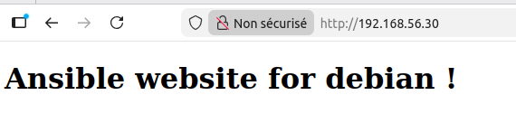

# Atelier 10 - Playbooks

**Un premier playbook apache-debian.yml qui installe Apache sur l'hôte debian avec une page personnalisée Apache web server running on Debian Linux.**

Voici notre playbook pour debian :
``` yaml title="apache-debian.yml"
---  # apache-debian.yml

- hosts: debian
  tasks:
    - name: Update package information
      apt:
        update_cache: true
        cache_valid_time: 3600

    - name: Install Apache
      apt:
        name: apache2

    - name: Start & enable Apache
      service:
        name: apache2
        state: started
        enabled: true

    - name: Install custom web page
      copy:
        dest: /var/www/html/index.html
        mode: 0644
        content: |
          <!doctype html>
          <html>
            <head>
              <meta charset="utf-8">
              <title>Test</title>
            </head>
            <body>
              <h1>Website managed by ansible for debian !</h1>
            </body>
          </html>

...
```

On vérifie que la syntaxe est correcte avec `yamllint`
```
$ yamllint apache-debian.yml
```

On se rend sur notre site :


**Un deuxième playbook apache-rocky.yml qui installe Apache sur l'hôte rocky avec une page personnalisée Apache web server running on Rocky Linux.**

Pour rocky, le playbook change légèrement :

- Pas besoin de mettre à jour les repo
- Utilisation de `dnf` à la place de `apt`
- Le nom du paquet pour Apache est `httpd`
- Le chemin du site par défaut est `/usr/share/httpd/noindex/index.html`

Voici le playbook pour rocky :
``` yaml title="apache-rocky.yml"

---  # apache-rocky.yml

- hosts: rocky
  tasks:
    - name: Install Apache
      dnf:
        name: httpd

    - name: Start & enable Apache
      service:
        name: httpd
        state: started
        enabled: true

    - name: Install custom web page
      copy:
        dest: /usr/share/httpd/noindex/index.html
        mode: 0644
        content: |
          <!doctype html>
          <html>
            <head>
              <meta charset="utf-8">
              <title>Test</title>
            </head>
            <body>
              <h1>Website managed by ansible for rocky !</h1>
            </body>
          </html>

...

```
On vérifie que la syntaxe est correcte avec `yamllint`
```
$ yamllint apache-rocky.yml
```

On se rend sur notre site :


**Un troisième playbook apache-suse.yml qui installe Apache sur l'hôte suse avec une page personnalisée Apache web server running on SUSE Linux.**