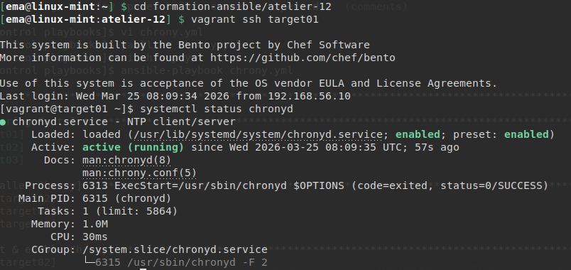
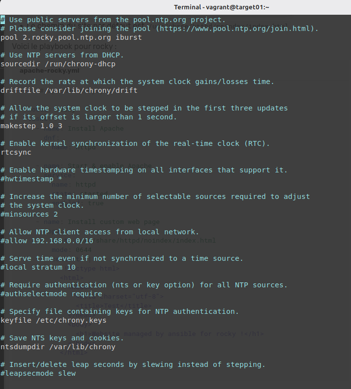
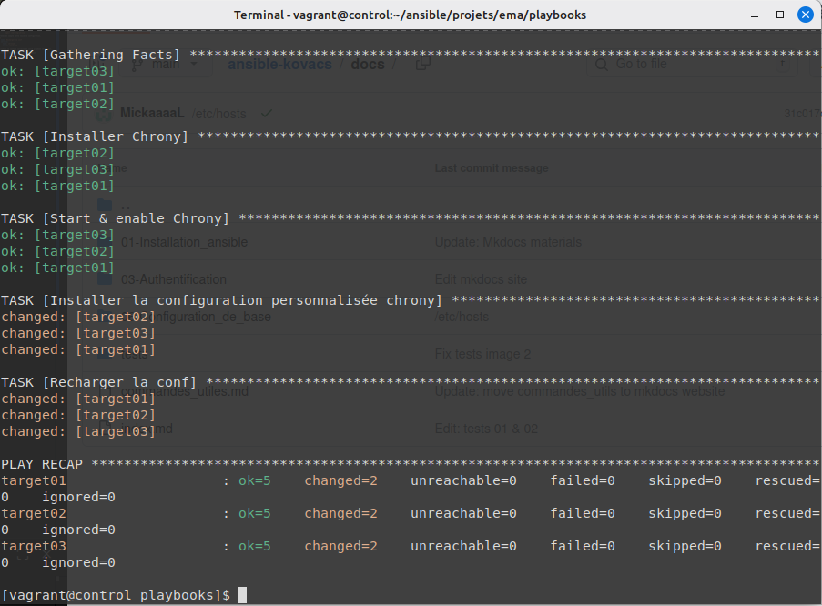
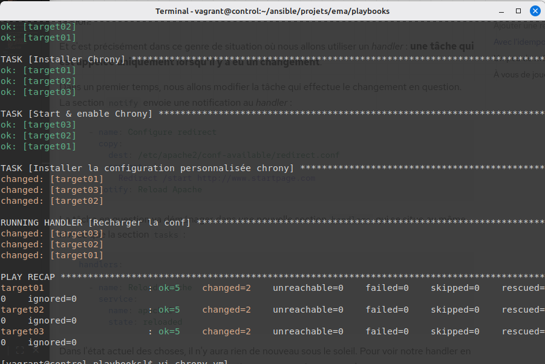

# Atelier 12 - Les handlers

Un playbook chrony.yml qui assure la synchronisation NTP de tous vos Target Hosts :

* Installez le paquet chrony. 
* Activez et démarrez le service chronyd correspondant.

```yml
---  # chrony.yml

- hosts: all
  tasks:
    - name: Installer Chrony
      dnf:
        name: chrony

    - name: Start & enable Chrony
      service:
        name: chronyd
        state: started
        enabled: true
```
**Vérification du service sur les target**



* Jetez un œil sur le fichier de configuration /etc/chrony.conf fourni par défaut.

```bash
vi /etc/chrony.conf
```


* Installez une configuration personnalisée (cf. ci-dessous).

```bash
# /etc/chrony.conf
server 0.fr.pool.ntp.org iburst
server 1.fr.pool.ntp.org iburst
server 2.fr.pool.ntp.org iburst
server 3.fr.pool.ntp.org iburst
driftfile /var/lib/chrony/drift
makestep 1.0 3
rtcsync
logdir /var/log/chrony

```

```yml
    - name: Installer la configuration personnalisée chrony
      copy:
        dest: /etc/chrony.conf
        mode: 0644
        content: |
          server 0.fr.pool.ntp.org iburst
          server 1.fr.pool.ntp.org iburst
          server 2.fr.pool.ntp.org iburst
          server 3.fr.pool.ntp.org iburst
          driftfile /var/lib/chrony/drift
          makestep 1.0 3
          rtcsync
          logdir /var/log/chrony
        
```

* Prenez en compte cette nouvelle configuration.
```yml
    - name: Recharger la conf
      service:
        name: chronyd
        state: restarted
```



* Vérifiez la syntaxe correcte de votre playbook chrony.yml.

```bash
yamllint chrony.yml
```
* Vérifiez l'idempotence de votre playbook

```yml 
#Pour l'idempotence, ajouter le handler et le module notify après copy

    - name: Installer la configuration personnalisée chrony
      copy:
        dest: /etc/chrony.conf
        mode: 0644
        content: |
          server 0.fr.pool.ntp.org iburst
          server 1.fr.pool.ntp.org iburst
          #server 2.fr.pool.ntp.org iburst
          server 3.fr.pool.ntp.org iburst
          driftfile /var/lib/chrony/drift
          makestep 1.0 3
          rtcsync
          logdir /var/log/chrony
      notify: Recharger la conf


  handlers:

    - name: Recharger la conf
      service:
        name: chronyd
        state: restarted


```
**Test pour voir l'idempotence**


# Playbook final 
```yml
---  # chrony.yml

- hosts: all
  tasks:
    - name: Installer Chrony
      dnf:
        name: chrony

    - name: Start & enable Chrony
      service:
        name: chronyd
        state: Started
        enabled: true

    - name: Installer la configuration personnalisée chrony
      copy:
        dest: /etc/chrony.conf
        mode: 0644
        content: |
          server 0.fr.pool.ntp.org iburst
          server 1.fr.pool.ntp.org iburst
          #server 2.fr.pool.ntp.org iburst
          server 3.fr.pool.ntp.org iburst
          driftfile /var/lib/chrony/drift
          makestep 1.0 3
          rtcsync
          logdir /var/log/chrony
      notify: Recharger la conf

  handlers:

    - name: Recharger la conf
      service:
        name: chronyd
        state: restarted
```