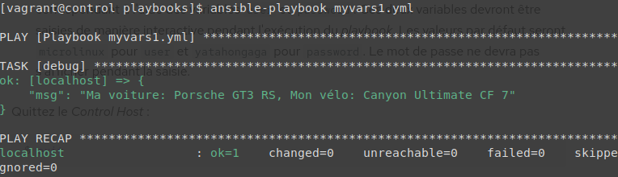
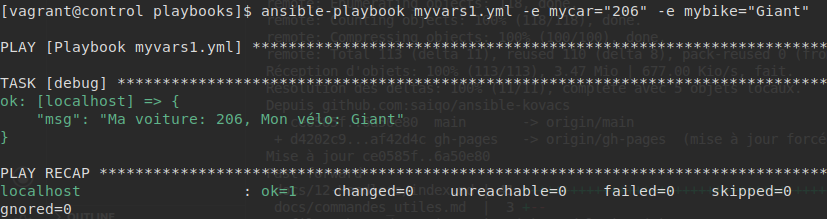
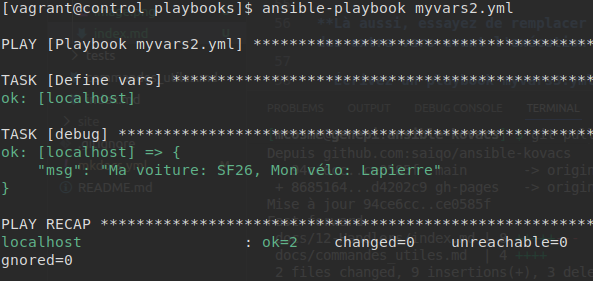
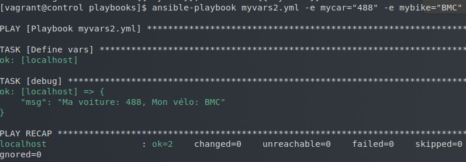
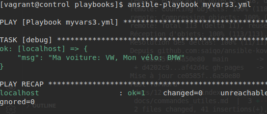
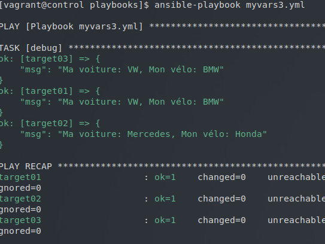
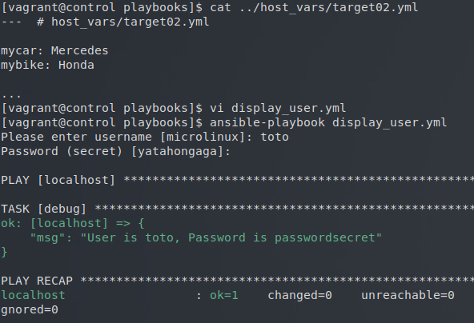

# Atelier 14 - Variables


**Écrivez un playbook myvars1.yml qui affiche respectivement votre voiture et votre moto préférée en utilisant le module debug et deux variables mycar et mybike définies en tant que play vars.**

Voici notre playbook pour debian :
``` yaml title="myvars1.yml"
---  # myvars1.yml
- name: Playbook myvars1.yml
  hosts: localhost
  gather_facts: false

  vars:
    mycar: "Porsche GT3 RS"
    mybike: "Canyon Ultimate CF 7"

  tasks:
    - debug:
        msg: "Ma voiture: {{ mycar }}, Mon vélo: {{ mybike }}"
```

Le résultat : 


**En utilisant les extra vars, remplacez successivement l'une et l'autre marque - puis les deux à la fois - avant d'exécuter le play.**

``` bash
$ ansible-playbook myvars1.yml -e mycar="206" -e mybike="Giant"
```

Résultat :


**Écrivez un playbook myvars2.yml qui fait essentiellement la même chose que myvars1.yml, mais en utilisant une tâche avec set_fact pour définir les deux variables.**

Playbook :
``` yaml title="myvars2.yml"
--- # myvars2.yml
- name: Playbook myvars2.yml
  hosts: localhost
  gather_facts: false

  tasks:
    - name: Define vars
      set_fact:
        mycar: SF26
        mybike: Lapierre

    - debug:
        msg: "Ma voiture: {{ mycar }}, Mon vélo: {{ mybike }}"
```

Résultat :


**Là aussi, essayez de remplacer les deux variables en utilisant des extra vars avant l'exécution du play.**

``` bash
ansible-playbook myvars2.yml -e mycar="488" -e mybike="BMC"
```

Résultat :


**Écrivez un playbook myvars3.yml qui affiche le contenu des deux variables mycar et mybike mais sans les définir. Avant d'exécuter le playbook, définissez VW et BMW comme valeurs par défaut pour mycar et mybike pour tous les hôtes, en utilisant l'endroit approprié.**

``` yaml title="myvars3.yml"
--- # myvars3.yml
- name: Playbook myvars3.yml
  hosts: localhost
  gather_facts: false

  tasks:
    - debug:
        msg: "Ma voiture: {{ mycar }}, Mon vélo: {{ mybike }}"
```

On va utiliser les group_vars :
```
$ mkdir -v ~/ansible/projets/ema/group_vars
```

``` yaml title="group_vars/all.yml"
---  # group_vars/all.yml

mycar: VW
mybike: BMW

...
```

Résultat :


**Effectuez le nécessaire pour remplacer VW et BMW par Mercedes et Honda sur l'hôte target02.**

On va utiliser les host_var pour target02

``` bash
$ mkdir -v ~/ansible/projets/ema/host_vars
```

``` yaml title="host_vars/target02.yml"
---  # host_vars/target02.yml

mycar: Mercedes
mybike: Honda

...
```

Résultat :


**Écrivez un playbook display_user.yml qui affiche un utilisateur et son mot de passe correspondant à l'aide des variables user et password. Ces deux variables devront être saisies de manière interactive pendant l'exécution du playbook. Les valeurs par défaut seront microlinux pour user et yatahongaga pour password. Le mot de passe ne devra pas s'afficher pendant la saisie.**

Voici notre playbook :
``` yaml title="display_user.yml"
--- # display_user.yml

- hosts: localhost
  gather_facts: false

  vars_prompt:

    - name: user
      prompt: Please enter username
      default: microlinux
      private: false

    - name: password
      prompt: Password (secret)
      default: yatahongaga
      private: true

  tasks:
    - debug:
        msg: "User is {{user}}, Password is {{password}}"

...

```

Résultat :
