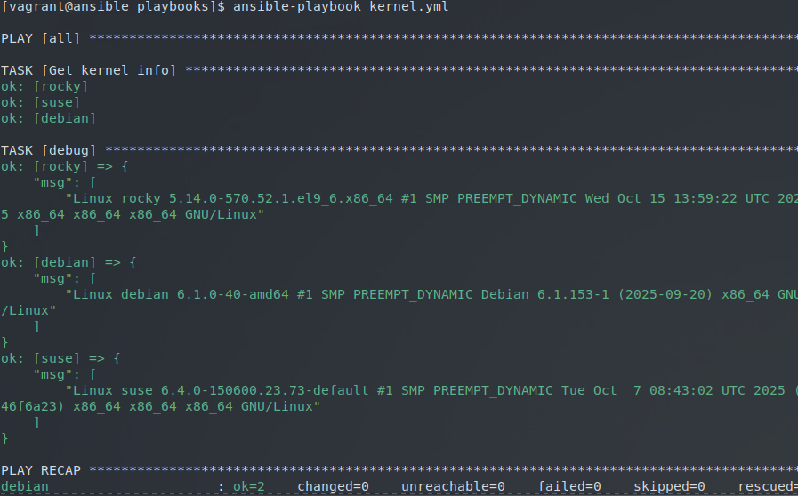
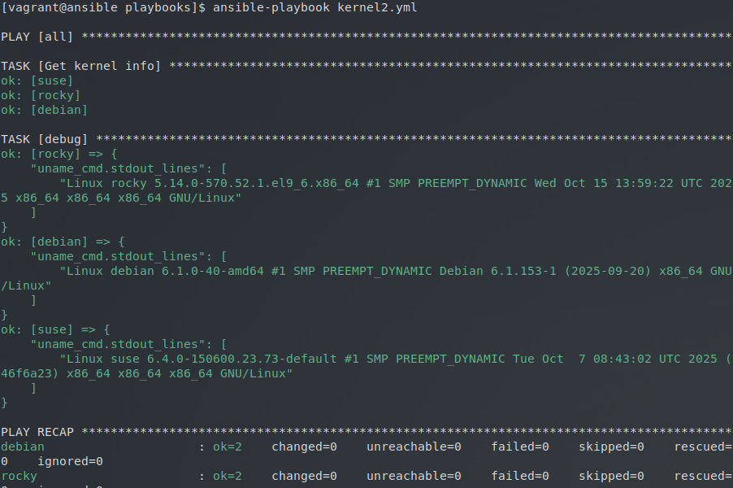
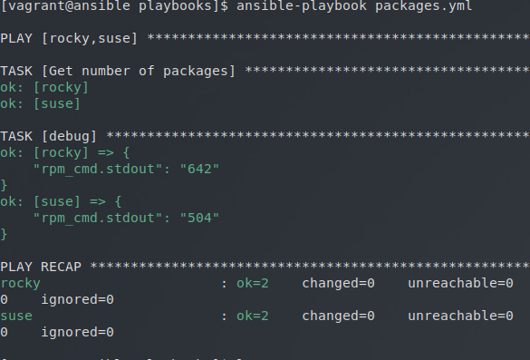

# Variables Enregistrés


**Écrivez un playbook kernel.yml qui affiche les infos détaillées du noyau sur tous vos Target Hosts. Utilisez la commande uname -a et le module debug avec le paramètre msg.**

Voici notre playbook :

``` yaml title="kernel.yml"
---  # kernel.yml

- hosts: all
  gather_facts: false

  tasks:

    - name: Get kernel info
      command: uname -a
      changed_when: false
      register: uname_cmd

    - debug:
        msg: "{{uname_cmd.stdout_lines}}"

...
```

Résultat :




**Essayez d'obtenir le même résultat en utilisant le paramètre var du module debug.**

Nous avons crée un deuxième playbook, qui cette fois-ci, utilise le paramètre `var` :

``` yaml title="kernel2.yml"
---  # kernel2.yml

- hosts: all
  gather_facts: false

  tasks:

    - name: Get kernel info
      command: uname -a
      changed_when: false
      register: uname_cmd

    - debug:
        var: uname_cmd.stdout_lines

...
```

Résultat : 



**Écrivez un playbook packages.yml qui affiche le nombre total de paquets RPM installés sur les hôtes rocky et suse (rpm -qa | wc -l).**

Pour ce playbook, nous ne pouvons pas utilisé le module `command`, car le `| wc -l` ne sera pas pris en compte. Nous devons donc utiliser le module `shell`.

De plus, nous avons changé le paramètre `hosts: all` en `hosts: rocky,suse`

Voici le playbook :

``` yaml title=""
---  # packages.yml

- hosts: rocky,suse
  gather_facts: false

  tasks:

    - name: Get number of packages
      shell: rpm -qa | wc -l
      changed_when: false
      register: rpm_cmd

    - debug:
        var: rpm_cmd.stdout

...
```

Résultat :


