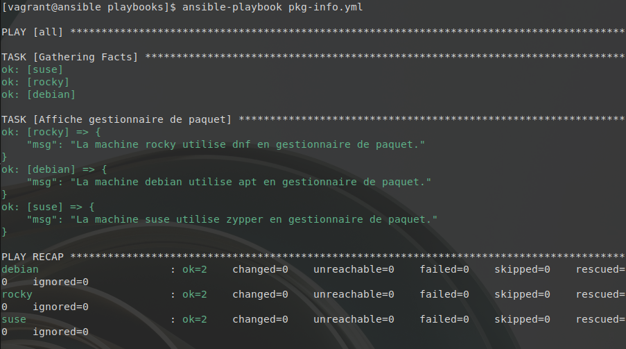
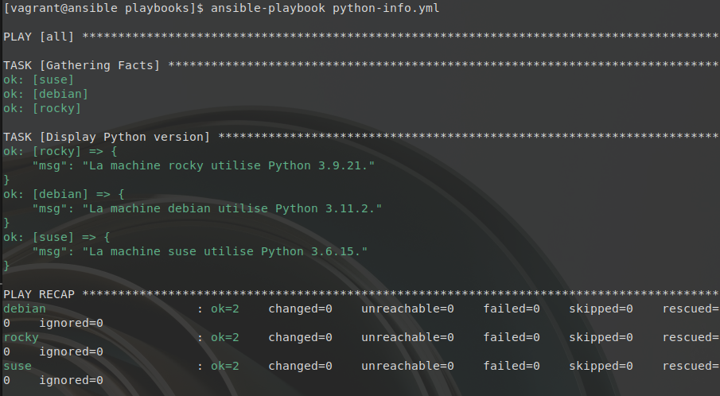
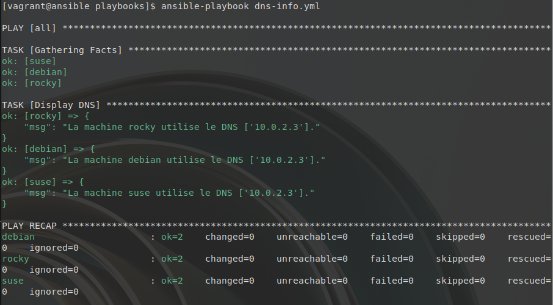

# Facts et variables implicites


**Écrivez trois playbooks pour afficher des informations sur chacun des Target Hosts :**

* pkg-info.yml pour afficher le gestionnaire de paquets utilisé
```yml
---  # pkg-info.yml

- hosts: all

  tasks:

    - name: Affiche gestionnaire de paquet
      debug:
        msg: "La machine {{ inventory_hostname }} utilise {{ ansible_pkg_mgr }} en gestionnaire de paquet."

```
Resultat:



* python-info.yml pour afficher la version de Python installée
```yml
---  # python-info.yml

- hosts: all

  tasks:

    - name: Display Python version
      debug:
        msg: >-
          La machine {{ inventory_hostname }} utilise Python
          {{ ansible_python_version }}.
```
Résultat:


* dns-info.yml pour afficher le(s) serveur(s) DNS utilisé(s)
```yml
---  # dns-info.yml

- hosts: all

  tasks:

    - name: Display DNS
      debug:
        msg: >-
          La machine {{ inventory_hostname }} utilise le DNS
          {{ ansible_dns }}.

```

Résultat:
