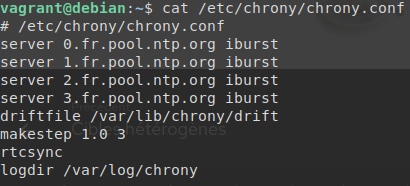
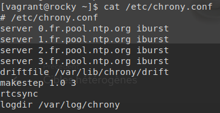

# Atelier 18 - Jinja et Templates

**Écrivez un playbook chrony.yml qui installe un fichier de configuration personnalisé sur vos cibles. La première ligne de commentaire devra indiquer le chemin complet vers le fichier :**

- Dans certains cas ce sera /etc/chrony/chrony.conf.
- Dans d'autres cas ce sera simplement /etc/chrony.conf.

Cette fois ci en utilisant des templates avec Jinja.

On reprends notre précédent playbook, qu'on adapte en modifiant le block "copy" en "template" :

``` yaml title="chrony.yml"
---  # chrony.yml

- hosts: all
  vars:
    chrony:
      chrony_package: chrony
      chrony_service: chronyd

      Debian:
        chrony_confdir: /etc/chrony/chrony.conf
      Ubuntu:
        chrony_confdir: /etc/chrony/chrony.conf
      Rocky:
        chrony_confdir: /etc/chrony.conf
      openSUSE Leap:
        chrony_confdir: /etc/chrony.conf

  tasks:
    - name: Update package information on Debian/Ubuntu
      apt:
        update_cache: true
        cache_valid_time: 3600
      when: ansible_os_family == "Debian"

    - name: Install chrony
      package:
        name: "{{chrony.chrony_package}}"
        state: present

    - name: Start chrony & enable it on boot
      service:
        name: "{{chrony.chrony_service}}"
        state: started
        enabled: true

    - name: Copy config file
      template:
        dest: "{{chrony[ansible_distribution].chrony_confdir}}"
        mode: 0644
        src: chrony.conf.j2
      notify: restart_chrony

  handlers:
    - name: restart_chrony
      service:
        name: "{{chrony.chrony_service}}"
        state: restarted

...

```

Ensuite, on crée un template : `templates/chrony.conf.j2`, et pour le commentaire on utilise la variable déclaré dans notre playbook.

La variable est défini par distribution, on peut donc l'utiliser dans notre template.

``` jinja title="templates/chrony.conf.j2"
{# templates/chrony.conf.j2 #}
# {{ chrony[ansible_distribution].chrony_confdir }}
server 0.fr.pool.ntp.org iburst
server 1.fr.pool.ntp.org iburst
server 2.fr.pool.ntp.org iburst
server 3.fr.pool.ntp.org iburst
driftfile /var/lib/chrony/drift
makestep 1.0 3
rtcsync
logdir /var/log/chrony

```

**Vérifications :**

Sur la VM debian :



Sur la VM rocky :

